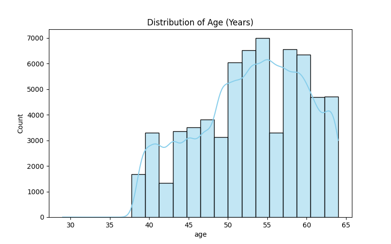
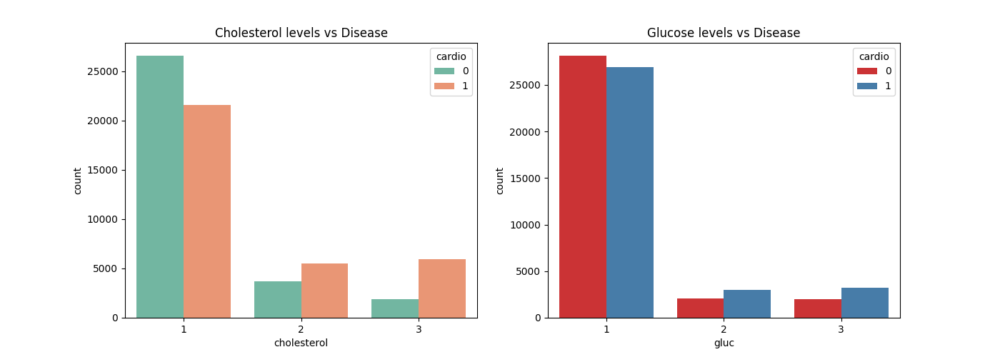

# Cardiovascular Disease Prediction 🫀


This project aims to predict the presence of cardiovascular disease in patients using medical examination data. By analyzing factors such as age, blood pressure, cholesterol, and lifestyle habits, we evaluate multiple Machine Learning models to provide an accurate diagnostic tool.

## 📌 Project Overview
Heart disease is a leading cause of mortality globally. This project follows a full data science pipeline—from data cleaning and exploratory analysis to model deployment—to identify high-risk patients.

## 📊 Dataset Description
The dataset consists of 70,000 records with the following features:
- **Age**: Objective Feature (converted from days to years).
- **Gender**: Categorical Feature.
- **Height/Weight**: Physical metrics.
- **Blood Pressure**: Systolic (`ap_hi`) and Diastolic (`ap_lo`).
- **Cholesterol/Glucose**: Ranked 1 to 3 based on severity.
- **Lifestyle**: Smoking, Alcohol, and Physical Activity.
- **Target**: `cardio` (Presence or absence of disease).

## 🛠️ Data Pre-processing
- **Feature Engineering**: Converted patient age into years for better interpretability.
- **Outlier Removal**: Cleaned blood pressure data by removing unrealistic values (e.g., negative values or values > 250 mmHg) and ensuring systolic pressure is higher than diastolic.
- **Data Integrity**: Removed duplicate entries and handled physical anomalies in height/weight data.

## 🔍 Exploratory Data Analysis (EDA)
### 1. Feature Correlation

The heatmap indicates that **Blood Pressure**, **Age**, and **Cholesterol** are the strongest predictors of cardiovascular disease.

### 2. Risk Factor Distribution

*Observation: The risk of disease significantly increases in patients aged 50 and above.*


*Observation: Patients with high cholesterol and glucose levels show a much higher incidence of heart disease.*

## 🤖 Machine Learning Performance
We evaluated five different classification algorithms. The data was scaled using `StandardScaler` to ensure optimal performance for distance-based models.

| Algorithm | Accuracy |
| :--- | :--- |
| **Support Vector Machine (SVM)** | **72.97%** |
| **Logistic Regression** | **72.55%** |
| **Random Forest** | **69.43%** |
| **K-Nearest Neighbor** | **68.45%** |
| **Decision Tree** | **62.11%** |

**Winner:** The **SVM** model provided the highest reliability and precision for this specific dataset.

## 🚀 How to Use
1. **Clone the repository:**
   ```bash
   git clone [https://github.com/ishikajaiswal657/Cardiovascular_Disease_Prediction.git](https://github.com/ishikajaiswal657/Cardiovascular_Disease_Prediction.git)
Install dependencies:

Bash

pip install pandas numpy matplotlib seaborn scikit-learn
Run the analysis:

Bash

python main.py
🎯 Conclusion
The project successfully demonstrates that blood pressure and age are primary indicators of cardiac health. The final model (SVM) can assist healthcare professionals in identifying at-risk patients with approximately 73% accuracy.
